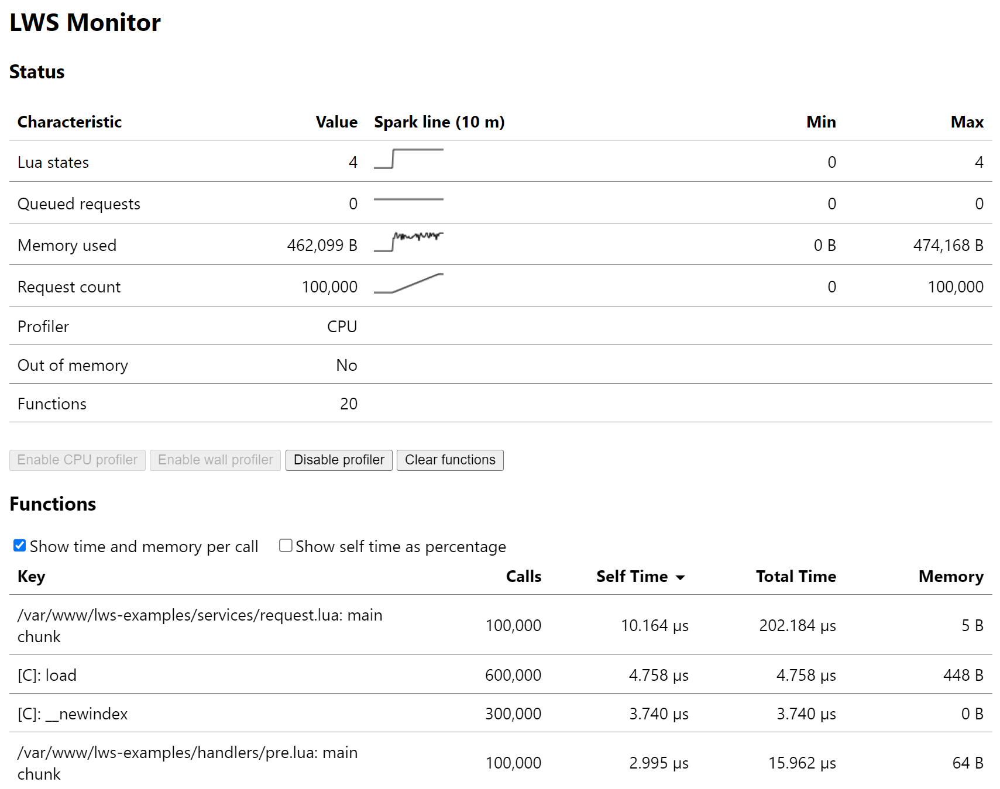

# LWS Monitor

The LWS monitor provides read-write access to central LWS characteristics. It is configured
through the `lws_monitor` [directive](Directives.md).

> [!WARNING]
> The LWS monitor should *not* be enabled at locations that are publicly accessible. Enabling
> the monitor at a location without appropriate access controls is a security risk.


## `GET` Method

The `GET` method returns a JSON document as follows:

```json
{
	"states_n": 0,
	"requests_n": 0,
	"memory_used": 0,
	"request_count": 0,
	"out_of_memory": 0,
	"profiler": 0,
	"functions": [
		["/var/www/lws-examples/services/request.lua:2: render_var", 282, 0, 774532, 0, 4464414, 15980],
		["/var/www/lws-examples/services/request.lua: main chunk", 47, 0, 1186461, 0, 11546675, 1880]
	]
}
```

The following table describes the keys of the document.

| Key | Type | Description |
| --- | --- | --- |
| `states_n` | `number` | Number of Lua states (active + inactive) |
| `requests_n` | `number` | Number of queued requests |
| `memory_used` | `number` | Memory used by Lua, in bytes |
| `request_count` | `number` | Total number of requests served |
| `out_of_memory` | `number` | Monitor has run out of memory; `0` = no, `1` = yes |
| `profiler` | `number` | Profiler status; `0` = disabled, `1` = enabled |
| `functions` | `array` | Profiled functions (see below) |

### Profiled Function

Each profiled function is represented by an array with the following values.

| Index | Type | Description |
| --- | --- | --- |
| 0 | `string` | Function key |
| 1 | `number` | Number of calls |
| 2 | `number` | Self time, seconds |
| 3 | `number` | Self time, nanoseconds |
| 4 | `number` | Total time, seconds |
| 5 | `number` | Total time, nanoseconds |
| 6 | `number` | Allocated memory, in bytes |

The profiler uses the fixed-size shared memory zone of the monitor. If the zone runs out of
memory, an error is logged, and the `out_of_memory` flag is set. In this case, the list of
profiled functions is incomplete.

The number of calls is exact for profiled functions.

Self time and total time are measured in thread CPU time (as opposed to wall time.) Each time is
represented as a sum of seconds and nanoseconds. Self time is the time spent in the function
per se, whereas as total time additionally includes the time spent in child functions, i.e.,
functions that are called from the parent function under consideration. A tail call is processed
as an exit from the parent function and thus does not accumulate child time. Due to profiler
overhead, time values are approximations.

Allocated memory is the amount of Lua memory allocated during the execution of the function per
se. Due to potential garbage collection, this is an approximation.

### Response Status

The response has a 200 OK status.


## `POST` Method

The `POST` method modifies the status of the LWS monitor. The content type of the request body
must be `application/x-www-form-urlencoded`. The following table describes the keys that can be
modified.

| Key | Description |
| --- | --- |
| `profiler` | Profiler status; `0` = disabled, `1` = enabled |
| `functions` | Profiled functions; `[]` to clear |

### Response Status

The response has a 200 OK status if the modification succeeded, a 400 Bad Request status if an
invalid value was provided, or a 409 Conflict status if the modification failed. The latter can
happen due to a concurrent modification.


## Examples Website

The [examples website](GettingStarted.md) includes a self-contained web page that periodically
queries the monitor for display, and allows for enabling and disabling the profiler.


