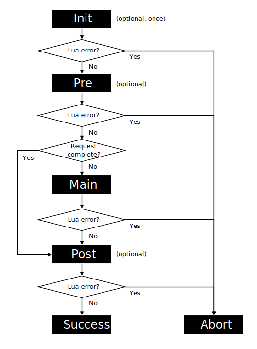

# LWS Request Processing

This document describes the general HTTP request processing logic of LWS.

Request processing involves up to four Lua chunks: an init chunk, a pre chunk, a main chunk, and
a post chunk.

## Init Lua Chunk

The init Lua chunk is run only once per Lua state. This optional chunk provides the opportunity
to initialize a Lua state and set up shared resources for requests, such as database connections.

The init Lua chunk runs with the *global* environment of the Lua state.

## Pre, Main, and Post Lua Chunks

The pre, main, and post Lua chunks are run sequentially for each request. The optional pre and
post chunks provide the opportunity to perform common tasks for the main chunks at the location,
such as establishing a context or performing logging.

The pre, main, and post Lua chunks run with a *request* environment that indexes the global
environment for keys that are not present. When a request completes, the request environment
is removed.

## Request Environment

The request environment initially provides the values `request` and `response`. These table values
manage information pertinent to the HTTP request.

### `request` Value

| Key | Type | Description |
| --- | --- | --- |
| `method` | `string` | HTTP request method |
| `uri` | `string` | HTTP request URI (includes path and query parameters) |
| `path` | `string` | HTTP request path |
| `args` | `string` | HTTP request query parameters |
| `headers` | `table`-like | HTTP request headers (case-insensitive keys, read-only) |
| `body` | `file` | HTTP request body (Lua file handle interface, read-only) |
| `path_info` | `string` | Path info, as defined with the `lws` directive |
| `ip` | `string`, `nil` | Remote IP address of the connection |

### `response` Value

| Key | Type | Description |
| --- | --- | --- |
| `status` | `integer` | HTTP response status (defaults to 200) |
| `headers` | `table`-like | HTTP response headers (case-insensitive keys) |
| `body` | `file` | HTTP response body (Lua file handle interface, write-only) |

## Chunk Result

A chunk must return no value, `nil`, or an integer as its result.

No value, nil, and `0` indicate success.

A negative integer result indicates failure and generates a Lua error. Results that are neither
`nil`, an integer, or convertible to an integer are processed as `-1` and thus generate a Lua
error as well.

A positive integer result from the pre or main chunk instructs the web server to send an error
response for the corresponding HTTP status code. For example, returning `lws.status.NOT_FOUND`
(or, equivalently, `404`), sends a "Not Found" page. You can control the content of the error
response with the `lws_error_response` and `error_page` directives. Positive integers outside
the range of 100 to 599 are processed as `500` and thus send an "Internal Server Error" page.
Returning a positive integer result from the pre chunk additionally marks the request as
*complete* (see below).

A positive integer result from the init or the post chunk is ignored.

> [!NOTE]
> Most main chunks produce a response body directly and must set `response.status` rather than
> returning an HTTP status code. Returning an HTTP status code *replaces* any response body
> written by the chunk with the error response.

## Processing Sequence

Generally, the Lua chunks are run in the order init (as required), pre, main, and post. All chunks
except the main chunk are optional.

If any chunk generates a Lua error, be it directly or indirectly through its result, the
processing is aborted.

If the pre chunk marks the request as *complete*, processing proceeds directly to the post chunk,
skipping the main chunk. The pre chunk can mark the request as complete by instructing the server
to send an error response (see above), or by calling a [library function](Library.md) with this
effect, such as `redirect`.

The following figure illustrates the request processing sequence.

## Lifecycle of Lua States

Lua states are kept open to handle subsequent requests when a request completes.

> [!WARNING]
> Developers must be careful not to leak information among requests, such as through the global
> environment or the Lua registry. Any request-specific state should be constrained to the request
> environment, and local variables.

Lua states read the Lua chunks from the file system only once. The resulting functions are then
cached. This is a performance optimization.

If processing is aborted due to a Lua error, the Lua state is closed after the request completes.

You can control the closing of Lua states with [directives](Directives.md), such as
`lws_max_requests`.
